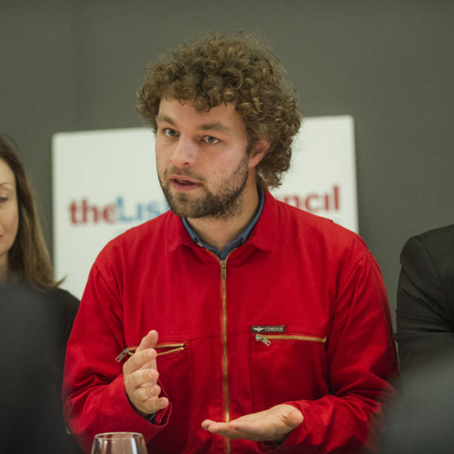

# Leadership

## Ben Cerveny

Ben Cerveny is a prolific entrepreneur, designer and strategist with over 25 years of experience in user interaction and experience design, concept prototyping, and strategy in the context of media applications, operating systems, web services, ubiquitous computing, and massively multiplayer games.

Most recently, he was a Design Fellow at Samsung, where he lead a team investigating design tools and operating systems for the built environment.

He was founder of Bloom Studios, whose generative design work Planetary is the first entirely digital piece in the Smithsonian collection. He was an advisor and strategist at Stamen Design, a leading visualization design studio, the founder of the Experience Design Lab at frog design, and lead designer and platform development strategist at Ludicorp, makers of Flickr.

## Boris van Hoytema

An entrepreneur and storyteller at heart, Boris van Hoytema likes to solve complex large-scale problems using technology and (broadcast) media.

He has experience as an editor, innovator, designer and technologist at BBC News and VPRO, running projects to reach new audiences, improve relationships with existing audiences, change production processes and cope with the ever increasing rate of change in technology and media consumption. Aside from this he has been a consulting CTO and advisor for technology and media startups.

As the founder of New Atoms, a Google DNI funded journalism and technology startup, he experimented with bringing Agile and scalable production methodologies to broadcast media.
